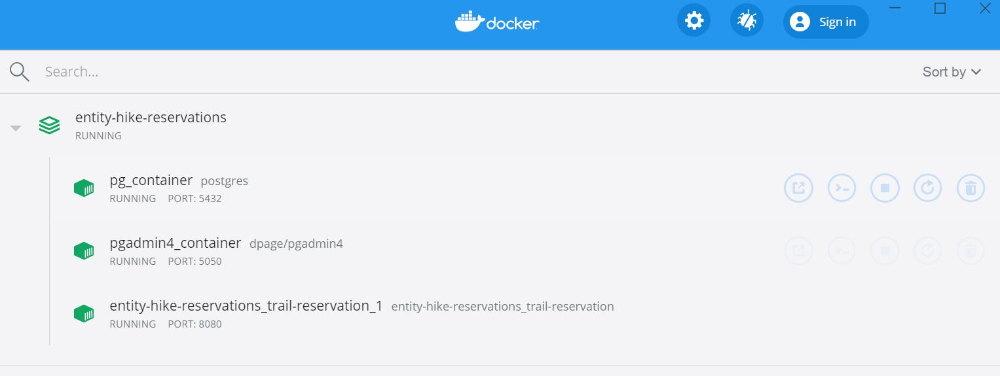
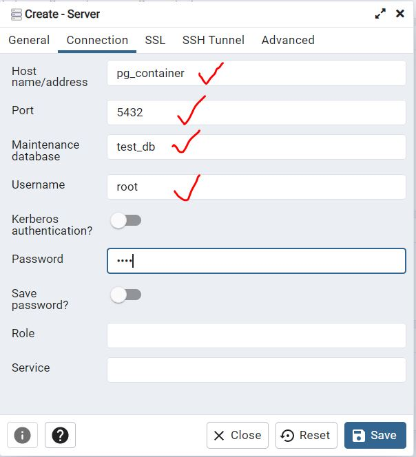
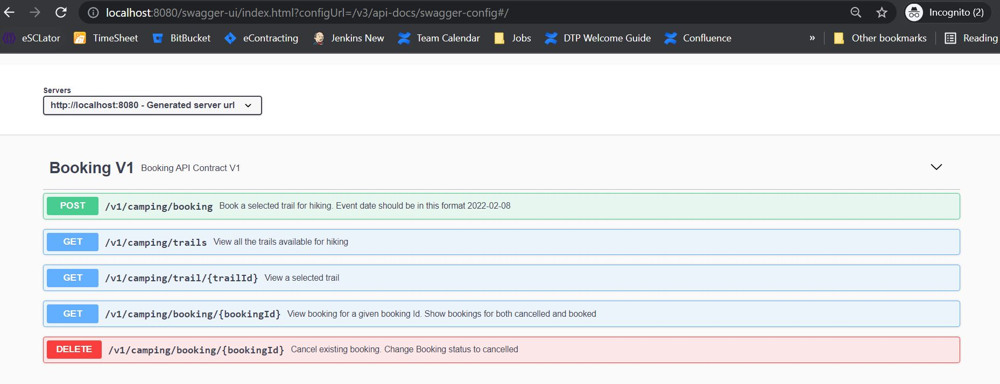
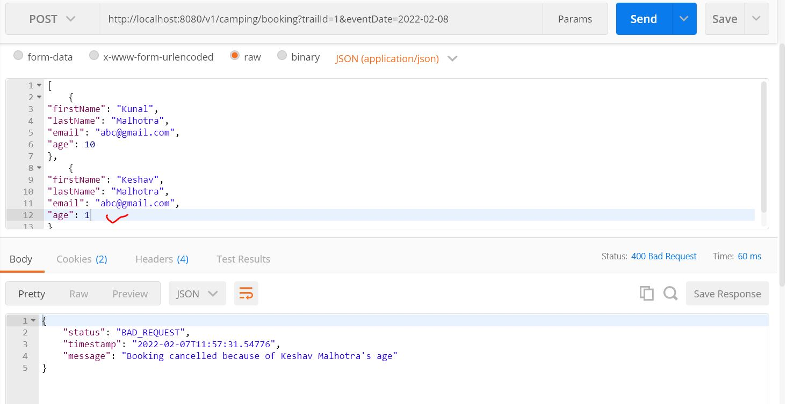

# entity-trail-reservations

## Prerequisite

You'll need:
 * Java 11
 * Maven 3.5.x
 * Docker
 * a environment variable JAVA_HOME pointing to your JAVA 11 installation

## Quickstart

Do the following commands in a shell:

    $ mvn clean
    $ mvn install
    $ docker-compose up
    
## Docker
After executing docker-compose up, you can see these images running in docker container
   

## PGAdmin
I have also integrated pgAdmin for data verification in the UI.
````curlrc
In the browser, type this url:
http://localhost:5050/login
Credentials:
Uid: admin@admin.com
Pswd: root
```` 

Password: root 

## Swagger
````curlrc
http://localhost:8080/swagger-ui.html
```` 


    
##  CURL Requests 
##### View All Trails
````curlrc
curl -X GET http://localhost:8080/v1/camping/trails
```` 
##### View a selected Trail
````curlrc
curl -X GET http://localhost:8080/v1/camping/trail/1
```` 
##### Book a Trail for Single/Multiple Users
````curlrc
curl -X POST \
  'http://localhost:8080/v1/camping/booking?trailId=1&eventDate=2022-02-08' \
  -H 'content-type: application/json' \
  -d '[
	{
"firstName": "Kunal",
"lastName": "Malhotra",
"email": "abc@gmail.com",
"age": 10
},
	{
"firstName": "Keshav",
"lastName": "Malhotra",
"email": "abc@gmail.com",
"age": 10
}
]'
```` 
##### View a Booking
````curlrc
curl -X GET http://localhost:8080/v1/camping/booking/5
```` 
##### Cancel a Booking
````curlrc
curl -X DELETE http://localhost:8080/v1/camping/booking/5
```` 
# Postman Collection
Attached in the project root directory

# Exception Handling
####Example: Invalid Age of one User

